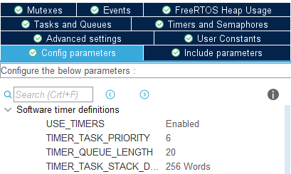
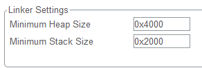

# UIML

---

## 简介

本项目为吉林大学`TARS_Go`战队**统一接口中间件库**(Uniform Interface Middlewares Library)，旨在提高底层代码的复用率，避免重复造轮子，缩短开发时间

本项目的目标是，做到尽可能少些甚至不写代码，不同机器人间仅通过修改配置文件进行适配

---

## 项目结构介绍

### 整体结构

整个项目由多个模块构成，基于FreeRTOS系统运行，所有模块被分成以下两类：
- **服务类模块**：可自运行的模块
  - 服务类模块是可以自己运行的，一般包含一个持续运行的FreeRTOS任务，或可以由外设中断触发，因此可以向其他模块主动提供服务
  - 每个服务类模块都需要在配置文件中进行配置
  - 例如：底盘模块、遥控器模块等
- **工具类模块**：无法自己运行的模块
  - 此类模块无法自行运行，不包含FreeRTOS任务，也不能由外设中断触发，其作用是被服务类模块直接调用，作为服务类模块的工具
  - 工具类模块没有在配置文件中的独立配置
  - 例如：PID计算模块、电机模块等

各服务类模块之间通过软总线进行数据交互，以实现模块间的松耦合 [查看软总线说明](softbus/README.md)

> 注意：服务类与它所用到的工具类模块是通过函数直接调用的，而不用经过软总线

项目中几个一级文件夹的作用：
- `conf`：配置模块和系统配置
- `softbus`：软总线模块
- `services`：服务类模块
- `tools`：工具类模块

---

## 使用步骤

1. 新建CubeMX工程，配置所需外设及FreeRTOS
   - 配置外设
   - 配置FreeRTOS
        - 使能FreeRTOS,并选择CMSIS_V1
   
		
		- 将初始任务的Code Generation Option设置为As weak,**不需要额外添加任何其他任务**

		
		- 打开软件定时器,并将其优先级设置为6，定时器队列大小设置为20
  
  		
		- 开启vTaskDelayUntil

		
   - 修改堆栈大小,建议大小为如下图所示

	
2. 将所有所需的文件添加至Keil工程
	- 文件依赖分析待完善
3. 编写配置文件，可参考各模块给出的说明和配置示例进行修改 [查看配置文件说明](conf/README.md)

---

## 添加模块

### 添加步骤

- 服务类模块
  - 底盘模块 [查看底盘文件说明](chassis/README.md)
  - BSP模块 [查看BSP文件说明](bsp/README.md)
  - 遥控器模块 [查看遥控器文件说明](rc/README.md)

### 相关规范

待完善

### Todo List

- 系统模块
	- [x] 系统配置模块
	- [x] 软总线模块
- 数学计算模块
	- [x] 斜坡函数
	- [x] PID计算
	- [ ] 一阶滤波
- 外设驱动模块
	- [x] CAN通信模块
	- [ ] 串口模块
	- [ ] SPI模块
	- [ ] IIC模块
	- [ ] TIM模块
	- [ ] USB虚拟串口模块
	- [ ] 外部中断模块
- 设备驱动模块
	- [ ] 遥控器驱动模块
	- [ ] IMU驱动模块
	- [ ] 电机模块
    	- [x] M3508
		- [x] M6020
		- [x] M2006
		- [ ] PWM电机
	- [ ] 裁判系统模块
- 运动控制模块
	- [ ] 底盘模块
		- [x] 麦轮底盘
		- [ ] 舵轮底盘
	- [ ] 云台模块
	- [ ] 射击模块
	- [ ] 机械臂模块
- 上层决策模块
	- [ ] 云台-底盘综合控制

### 参与贡献

1.  Fork 本仓库
2.  提交代码
3.  新建 Pull Request

