	
	
<i>“只改配置文件就能让各种机器人动起来？试试 UIML 吧！”</i>

	

		
		
		
		
	

## 项目简介

**UIML**为吉林大学`TARS_Go`战队**统一接口中间件库**(Uniform Interface Middlewares Library)，旨在提高底层代码的复用率，避免重复造轮子，提高开发效率

本项目基于 FreeRTOS 在 STM32 平台上运行，由一个**轻量级调度框架**和**一系列周边模块**构成，具有易上手、易操作、易拓展的特点，用户可以仅通过修改配置文件随意选用已有模块，或按要求自行编写其他模块

### 本项目特点

- 与 Linux 内核驱动相似的模块管理机制
	- 低耦合、易增删的**动态模块管理**
	- 与 Json 文件相似的**系统配置**方式
- 模块间通信主要使用观察者模式
	- 与 ROS 相似的**话题订阅**机制
	- 与安卓系统相似的**广播**机制
	- 与网络请求相似的**远程函数**机制

### 本项目最终目标

尽可能少写甚至不写代码，不同机器人间仅通过修改配置文件进行适配，或仅需添加少量上层个性化逻辑

---

## 项目结构介绍

### 整体结构

整个项目主要有**核心模块**和**周边模块**两大部分

#### 核心模块

项目的核心模块有软总线模块和系统配置模块，是维持整个框架运行不可缺少的部分
- **软总线模块**：负责周边模块之间所有数据的传输，提供了广播和远程函数等功能 [查看软总线说明](softbus/README.md)
- **系统配置模块**：负责读取用户的系统配置，并负责触发各个周边模块的运行 [查看配置模块说明](conf/README.md)

#### 周边模块

周边模块是在核心模块基础上运行的用户模块，可由用户自行配置随意选用。周边模块被分成以下两大类：
- **服务类模块**：可自运行的模块
	- 服务类模块是可以自己运行的，一般包含一个持续运行的FreeRTOS任务，或可以由外设中断触发，因此可以向其他模块主动提供服务
	- 每个服务类模块都需要在配置文件中进行配置
	- 例如：串口驱动、底盘模块、遥控器模块等
- **工具类模块**：无法自己运行的模块
	- 此类模块无法自行运行，不包含FreeRTOS任务，也不能由外设中断触发，其作用是被服务类模块通过函数接口直接调用，作为服务类模块的工具使用
	- 工具类模块没有在配置文件中的独立配置，而是通过服务类模块进行配置
	- 例如：滤波模块、PID计算模块、电机模块等

### 文件目录

项目中几个一级文件夹的作用：
- `conf`：系统配置模块和用户配置文件
- `softbus`：软总线模块
- `services`：服务类模块
- `tools`：工具类模块

---

## 开发指南

详细的开发说明请移步 [UIML开发指南](tutorial.md) 进行查看，其中包含了使用步骤、开发说明、开发规范、注意事项等详细内容

---

## Todo List

- 系统模块
	- [x] 系统配置模块
	- [x] 软总线模块
	- [ ] 离线检测模块
- 数学计算模块
	- [x] 斜坡函数
	- [x] PID计算
	- [x] 一阶滤波
- 外设驱动模块
	- [x] CAN通信模块
	- [x] 串口模块
	- [x] SPI模块
	- [ ] IIC模块
	- [x] TIM模块
	- [ ] USB虚拟串口模块
	- [x] 外部中断模块
- 设备驱动模块
	- [x] 遥控器驱动模块
	- [ ] 蜂鸣器音乐模块
	- [ ] INS模块
    	- [x] bmi088驱动
    	- [ ] MPU6500驱动
    	- [ ] IST8310驱动
    	- [ ] JY901驱动
	- [x] 电机模块
    	- [x] M3508
		- [x] M6020
		- [x] M2006
		- [x] PWM电机
		- [x] 直流电机
	- [x] 裁判系统模块
- 运动控制模块
	- [ ] 底盘模块
		- [x] 麦轮底盘
		- [ ] 舵轮底盘
	- [x] 云台模块
	- [x] 射击模块
	- [ ] 机械臂模块
- 上层决策模块
	- [x] 云台-底盘综合控制

---

## 参与贡献

1.  Fork 本仓库
2.  提交代码
3.  新建 Pull Request

