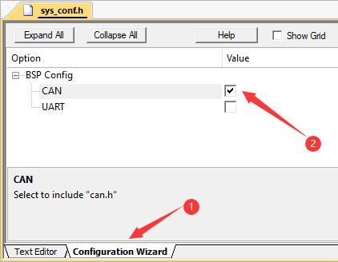

# 系统配置模块

---

## 简介

这是整个代码库的配置模块，提供用户配置接口和给库代码读取用户配置的接口

---

## 包含文件

- `config.c/h`：配置模块相关代码
- `sys_conf.h`：用户配置文件

---

## `sys_conf.h`语法

用户配置文件分为以下三部分

**依赖头文件配置**

下方的服务配置可能会用到一些其他文件中定义的变量(如`hcan1`等)，因此需要在此配置引用的文件

此部分支持Keil的**Configuration Wizard**图形化配置，在Keil中勾选对应项即可



**服务列表配置**

此部分用于配置系统需要使用哪些服务，对于配置的每一个服务，都会使用所配置的任务函数和优先级自动创建一个FreeRTOS任务

```c
//配置语法
#define SERVICE_LIST \
	SERVICE(服务名1, 服务任务函数1, 任务优先级1, 任务栈大小) \
	SERVICE(服务名2, 服务任务函数2, 任务优先级2, 任务栈大小) \
	...
```

**各服务配置项**

此部分是配置文件的核心内容，包含每个服务所需的所有配置项的值

整个配置表由一个个的**字典**(dict)嵌套构成，每个字典由一系列的**配置项**(item)构成，每个配置项包含一个**配置名**和一个**配置值**，如下例就是一个无嵌套字典的结构

```c
//一个字典
CF_DICT{
	{"配置名1", "配置值1"}, //一个配置项
	{"配置名2", "配置值2"}, //第二个配置项
	CF_DICT_END //标记字典结束
};
```

其中，配置名必须是字符串，配置值则可以是任何类型(`void*`)，因此可以进行字典的嵌套

```c
CF_DICT{
	{"配置名1", CF_DICT{
		{"配置名2", "配置值2"},
		CF_DICT_END //注意每个字典最后都要写这个
	}}, 
	CF_DICT_END
};
```

但要注意的是，配置值必须是指向实际数据的指针，而立即数是无法取址的，因此模块提供了`IM_PTR`宏用于将立即数转为字面量再取址

```c
{"配置名", &123} //不符合语法
{"配置名", IM_PTR(int, 123)} //用IM_PTR给立即数取址
```

最后，整个系统的配置表变量应命名为`systemConfig`，其第一层配置项的各配置名须与上述服务列表中的服务名相同，配置值就是该服务的配置表

```c
ConfItem* systemConfig = CF_DICT{
	{"服务名1", CF_DICT{
		//服务1的配置项
	}},
	{"服务名2", CF_DICT{
		//服务2的配置项
	}},
	//...
	CF_DICT_END
};
```

---

## `config.c/h`解析接口

> 本部分接口提供给库内部的服务模块使用，如果您不是库模块开发者而只是使用者，则无需阅读此篇章

在系统运行后，本模块会依照用户的配置逐个拉起服务任务线程，并将用户配置中每个服务的配置项分别作为任务函数的参数传入，任务函数以此获取用户配置

```c
void Module1_TaskFunction(void const * argument)
{
	ConfItem* dict = argument; //获取用户配置字典
	//...
	while(1)
	{
		//...
	}
}
```

获取到dict后即可通过本模块提供的几个接口获取各个配置值

```c
Conf_ItemExist(dict, name); //判断配置名是否存在，返回1表示存在，0表示不存在
Conf_GetPtr(dict, name, type); //获取配置值指针，返回类型为(type*)
Conf_GetValue(dict, name, type, def); //获取配置值(type类型)，若不存在则返回默认值def
```

各个接口中所传入的配置名可以以`/`分隔，以读取所嵌套的dict内部的变量，如下例

```c
//用户配置
ConfItem* dict = CF_DICT{
	{"name1", CF_DICT{
		{"name2", "value2"},
		CF_DICT_END
	}}, 
	CF_DICT_END
};

//这样可以取到内层dict
ConfItem* innerDict = Conf_GetPtr(dict, "name1", ConfItem);
//这样可以直接读到"value2"
char* value =  Conf_GetPtr(dict, "name1/name2", char);
```
