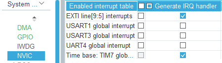

# BSP模块

---

## 简介

这是整个代码库的BSP模块，提供用户与串口、spi、can等外设通信的软总线接口

## 模块依赖项

- 本项目文件
	- `softbus.c/h`、`config.c/h`、`sys_conf.h`
- 标准库文件
	- `stdint.h`、`string.h`、`stdlib.h`
- hal库文件 
    - `cmsis_os.h`

---

> 注：下面远程函数所写的数据类型为指针的项仅强调该项传递的应该是数组，实际传递的参数只需数组名即可，不需要传递数组名的地址。广播也是如此，所写的数据类型若为指针的仅强调该项传递的应该是数组，获取该项的值是仅需要强制类型转换成相应的指针即可，无需额外解引用

---

## **bsp_can**

### 额外依赖
- hal库文件 
    - `can.h`

### 特殊说明

在本`bsp_can`模块中创新的提出了循环帧的概念，是用来针对大疆电机电调一个can数据帧同时包含了4个电机的控制电流数据的情况。id不同的循环帧会根据设置的间隔时间循环发送can数据，不同id的大疆电机在计算完pid之后可以通过请求调用`/can/set-buf`的远程函数覆盖掉该电机所属循环帧对应的数据字节，由于其他字节不受影响，所以可以实现同时控制多个电机的目的。

### 在`sys_conf.h`中的配置

```c
{"can", CF_DICT{
    //CAN控制器信息
    {"cans", CF_DICT{
        {"0", CF_DICT{    //相当于数组下标，在一个配置名下如果有多个配置项的话，需要按顺序依次顺序输入
            {"hcan", &hcan1},  //can句柄
            {"number", IM_PTR(uint8_t, 1)},  //can控制器编号，就是canX的X
            CF_DICT_END
        }},
        {"1", CF_DICT{
            {"hcan", &hcan2},
            {"number", IM_PTR(uint8_t, 2)},
            CF_DICT_END
        }},
        CF_DICT_END
    }},
    //循环帧配置
    {"repeat-buffers", CF_DICT{
        {"0", CF_DICT{
            {"can-x", IM_PTR(uint8_t, 1)}, //can几
            {"id", IM_PTR(uint16_t, 0x200)}, //循环帧的id
            {"interval", IM_PTR(uint16_t, 2)}, //循环帧的发送间隔
            CF_DICT_END
        }},
        {"1",CF_DICT{
            {"can-x", IM_PTR(uint8_t, 1)},
            {"id", IM_PTR(uint16_t, 0x1FF)},
            {"interval", IM_PTR(uint16_t, 2)},          
            CF_DICT_END
        }},
        {"2",CF_DICT{
            {"can-x", IM_PTR(uint8_t, 2)},
            {"id", IM_PTR(uint16_t, 0x200)},
            {"interval", IM_PTR(uint16_t, 2)},          
            CF_DICT_END
        }},		
        {"3", CF_DICT{
            {"can-x", IM_PTR(uint8_t, 2)},
            {"id", IM_PTR(uint16_t, 0x1FF)},
            {"interval", IM_PTR(uint16_t, 2)},
            CF_DICT_END
        }},
        CF_DICT_END
    }},
    CF_DICT_END
}},
```

### 模块接口

- 广播
    
    - 快速方式：
  
        1. `/can_/recv`
   
            说明：can的接收到数据后会将原始数据广播到软总线上。**如果是can1收到数据，其广播名应为`/can1/recv`**

            广播数据：

            | 索引 | 数据类型 | 说明 |
            | :---: | :---: | :---: |
            | `0` | `uint16_t` | can数据id |
            | `1` | `uint8_t*` | 接收到的can数据 |

- 远程函数
  
    1. `/can/set-buf`

        说明：设置循环帧的数据字节

        传入参数数据：
  
        | 数据字段名 | 数据类型 | 是否为返回值 | 是否必须传输 | 说明 |
        | :---: | :---: | :---: | :---: | :---: |
        | `can-x`| `uint8_t` | × | 必须 | canX的X     |
        | `id`	 | `uint16_t`| × | 必须 | can数据的id |
        | `pos`	 | `uint8_t` | × | 必须 | 覆盖循环帧数据域起始字节位置  |
        | `len`	 | `uint8_t` | × | 必须 | 需要覆盖循环帧长度(字节) |
        | `data` | `uint8_t*`| × | 必须 | 覆盖循环帧的数据 |
    
    2. `/can/send-once`

        说明：发送一帧can数据

        传入参数数据：
  
        | 数据字段名 | 数据类型 | 是否为返回值 | 是否必须传输 | 说明 |
        | :---: | :---: | :---: | :---: | :---: |
        | `can-x`| `uint8_t` | × | 必须 | canX的X     |
        | `id`	 | `uint16_t`| × | 必须 | can数据的id |
        | `data` | `uint8_t*`| × | 必须 | 一帧can数据(8字节) |

---

## **bsp_exti**

### 额外依赖
- hal库文件 
    - `gpio.h`

### 在`sys_conf.h`中的配置

```c
{"exti",CF_DICT{
	{"extis",CF_DICT{
		{"0",CF_DICT{ //相当于数组下标，在一个配置名下如果有多个配置项的话，需要按顺序依次顺序输入
			{"gpio-x", GPIOA},
			{"pin-x",IM_PTR(uint8_t,0)}, 
			CF_DICT_END
		}},
		{"1",CF_DICT{
			{"gpio-x", GPIOA},
			{"pin-x",IM_PTR(uint8_t,4)},
			CF_DICT_END
		}},
		CF_DICT_END
	}},
	CF_DICT_END
}},
```

### 模块接口

- 广播
    
    - 快速方式：
  
        1. `/exti/pin_`
   
            说明：在外部中断触发后会将其触发事件广播到软总线上。**如果是pin1线发生了外部中断，其广播名应为`/exti/pin1`，如果是pin10线发生了外部中断，其广播名应为`/exti/pin10`**

            广播数据：

            | 索引 | 数据类型 | 说明 |
            | :---: | :---: | :---: |
            | `0` | `GPIO_PinState` | 触发外部中断的电平 |

- 远程函数：无

---

## **bsp_spi**

### 额外依赖
- hal库文件 
    - `spi.h`
    - `gpio.h`

### 特殊说明

在本`bsp_spi`模块中考虑到可能会有多个外设在一条总线上通过片选分别去通信，以防同一时刻有两个外设同时拉低片选，造成总线冲突，我们在拉低片选前会进行上锁。我们由于freertos的互斥量和递归锁不支持在中断中进行解锁操作，因此我们使用信号量作为锁以保证在同一时刻仅有一个外设占据总线进行通信。

> 注：若请求远程函数`/spi/block`或`/spi/trans/dma`时如果不传递`rxData`参数，则会默认指向spi分配的缓冲区。如果使用远程函数`/spi/trans/dma`时传递了`rxData`参数，尽管会广播接收到的数据，但实际接收到的数据在您传递的`rxData`的指针里，该广播仅当做spi数据接收完成事件即可

### 在`sys_conf.h`中的配置

```c
{"spi",CF_DICT{
	{"spis",CF_DICT{
		{"0",CF_DICT{
			{"hspi", &hspi1},
			{"number",IM_PTR(uint8_t,1)},
			{"max-recv-size",IM_PTR(uint8_t,10)},
			{"cs",CF_DICT{
				{"0",CF_DICT{
					{"pin", IM_PTR(uint8_t,0)},
					{"name", "gyro"},
					{"gpio-x", GPIOB},
					CF_DICT_END
				}},
				{"1",CF_DICT{
					{"pin", IM_PTR(uint8_t,4)},
					{"name", "acc"},
					{"gpio-x", GPIOA},
					CF_DICT_END
				}},          
				CF_DICT_END
				}},
			CF_DICT_END
			}},
		CF_DICT_END
		}},
	CF_DICT_END
}},
```

### 模块接口

- 广播
    
    - 快速方式：
  
        1. `/spi_/recv`
   
            说明：spi使用dma方式(暂不支持中断方式)传输的数据在接收到数据后会将原始数据广播到软总线上。**如果是spi1收到数据，其广播名应为`/spi1/recv`**

            广播数据：

            | 索引 | 数据类型 | 说明 |
            | :---: | :---: | :---: |
            | `0` | `uint8_t*` | 接收到的spi数据 |
            | `1` | `uint16_t` | 接收到的spi数据的长度 |

- 远程函数
  
    1. `/spi/block`

        说明：使用阻塞方式进行spi通信

        传入参数数据：
  
        | 数据字段名 | 数据类型 | 是否为返回值 | 是否必须传输 | 说明 |
        | :---: | :---: | :---: | :---: | :---: |
        | `spi-x`   | `uint8_t`  | × | 必须 | spiX的X     |
        | `tx-data` | `uint8_t*` | × | 必须 | spi发送数据 |
        | `rx-data` | `uint8_t*` | √ | 可选 | spi接收数据，若传入则默认指向spi缓冲区  |
        | `len`     | `uint16_t` | × | 必须 | spi传输数据长度(字节) |
        | `timeout` | `uint32_t` | × | 必须 | spi阻塞式发送等待的超时时间 |
		| `cs-name` | `char*`    | × | 必须 | 片选名，与在配置表里配置的有关 |
        | `is-block`| `bool*`    | × | 必须 | 如果spi正在通信是否阻塞等待上一个设备通信结束后再通信 |
    
    2. `/spi/trans/dma`

        说明：使用DMA方式进行spi通信

        传入参数数据：
  
        | 数据字段名 | 数据类型 | 是否为返回值 | 是否必须传输 | 说明 |
        | :---: | :---: | :---: | :---: | :---: |
        | `spi-x`   | `uint8_t`  | × | 必须 | spiX的X     |
        | `tx-data` | `uint8_t*` | × | 必须 | spi发送数据 |
        | `rx-data` | `uint8_t*` | √ | 可选 | spi接收数据，若传入则默认指向spi缓冲区  |
        | `len`     | `uint16_t` | × | 必须 | spi传输数据长度(字节) |
		| `cs-name` | `char*`    | × | 必须 | 片选名，与在配置表里配置的有关 |
        | `is-block`| `bool*`    | × | 必须 | 如果spi正在通信是否阻塞等待上一个设备通信结束后再通信 |

---

## **bsp_tim**

### 额外依赖
- hal库文件 
    - `tim.h`

### 在`sys_conf.h`中的配置

```c
{"tim",CF_DICT{
	{"tims",CF_DICT{
		{"0",CF_DICT{ //相当于数组下标，在一个配置名下如果有多个配置项的话，需要按顺序依次顺序输入
			{"htim",&htim2}, //tim句柄
			{"number",IM_PTR(uint8_t,2)}, //timX的X
			{"mode","encode"},
			CF_DICT_END
		}},
		{"1",CF_DICT{
			{"htim",&htim1},
			{"number",IM_PTR(uint8_t,1)},
			{"mode","pwm"},
			CF_DICT_END
		}}, 
		CF_DICT_END
	}},
	CF_DICT_END
}},
```

### 模块接口

- 广播：无
    
- 远程函数
  
    1. `/tim/pwm/set-duty`

        说明：设置PWM占空比

        传入参数数据：
  
        | 数据字段名 | 数据类型 | 是否为返回值 | 是否必须传输 | 说明 |
        | :---: | :---: | :---: | :---: | :---: |
        | `tim-x`     | `uint8_t` | × | 必须 | timX的X     |
        | `channel-x` | `uint8_t` | × | 必须 | 定时器的通道几 |
        | `duty`      | `float`   | × | 必须 | PWM的占空比 **(范围0-1)**  |
    
    2. `/tim/encode`

        说明：获取当前编码器值

        传入参数数据：
  
        | 数据字段名 | 数据类型 | 是否为返回值 | 是否必须传输 | 说明 |
        | :---: | :---: | :---: | :---: | :---: |
        | `tim-x`       | `uint8_t`  | × | 必须 | spiX的X     |
        | `count`       | `uint32_t` | √ | 必须 | 返回当前编码器的值 |
        | `auto-reload` | `uint8_t*` | √ | 可选 | 返回cubemx配置的该定时器的自动重装值  |

---

## **bsp_usart**

### 额外依赖
- hal库文件 
    - `usart.h`

### 特殊说明

由于hal没有空闲中断回调函数，因此如果完成空闲中断只能在中断服务函数中自行处理。为了尽可能减少用户在使用本项目的操作成本，在本`bsp_usart`模块中需要在STM32CubeMX[取消生成串口的中断服务函数](#在STM32CubeMX中需要的额外配置)，由我们在模块内部自行定义。

### 在STM32CubeMX中需要的额外配置

- 在CubeMX工程NVIC的代码生成中，取消生成串口的中断服务函数，如下图所示
    

### 在`sys_conf.h`中的配置

```c
{"uart",CF_DICT{
	{"uarts",CF_DICT{
		{"0",CF_DICT{ //相当于数组下标，在一个配置名下如果有多个配置项的话，需要按顺序依次顺序输入
			{"huart",&huart1},
			{"uart-x",IM_PTR(uint8_t,1)},
			{"max-recv-size",IM_PTR(uint16_t,100)},
			CF_DICT_END
		}},
		{"1",CF_DICT{
			{"huart",&huart3},
			{"uart-x",IM_PTR(uint8_t,3)},
			{"max-recv-size",IM_PTR(uint16_t,18)},
			CF_DICT_END
		}},
		{"2",CF_DICT{
			{"huart",&huart6},
			{"uart-x",IM_PTR(uint8_t,6)},
			{"max-recv-size",IM_PTR(uint16_t,300)},
			CF_DICT_END
		}},
		CF_DICT_END
	}},	
	CF_DICT_END
}},
```

### 模块接口

- 广播
    
    - 快速方式：
  
        1. `/uart_/recv`
   
            说明：spi使用dma方式(暂不支持中断方式)传输的数据在接收到数据后会将原始数据广播到软总线上。**如果是spi1收到数据，其广播名应为`/uart1/recv`**

            广播数据：

            | 索引 | 数据类型 | 说明 |
            | :---: | :---: | :---: |
            | `0` | `uint8_t*` | 接收到的串口数据 |
            | `1` | `uint16_t` | 接收到的串口数据的长度 |

- 远程函数
  
    1. `/uart/trans/block`

        说明：使用阻塞方式进行spi通信

        传入参数数据：
  
        | 数据字段名 | 数据类型 | 是否为返回值 | 是否必须传输 | 说明 |
        | :---: | :---: | :---: | :---: | :---: |
        | `uart-x`    | `uint8_t`  | × | 必须 | uartX的X     |
        | `data`      | `uint8_t*` | × | 必须 | 串口发送数据 |
        | `trans-size` | `uint16_t` | × | 必须 | 串口发送数据长度  |
        | `timeout`   | `uint32_t` | × | 必须 | 串口阻塞式发送等待的超时时间 |
    
    2. `/uart/trans/it`

        说明：使用DMA方式进行spi通信

        传入参数数据：
  
        | 数据字段名 | 数据类型 | 是否为返回值 | 是否必须传输 | 说明 |
        | :---: | :---: | :---: | :---: | :---: |
        | `uart-x`    | `uint8_t`  | × | 必须 | uartX的X     |
        | `data`      | `uint8_t*` | × | 必须 | 串口发送数据 |
        | `trans-size` | `uint16_t` | × | 必须 | 串口发送数据长度  |

	3. `/uart/trans/dma`

        说明：使用DMA方式进行spi通信

        传入参数数据：
  
        | 数据字段名 | 数据类型 | 是否为返回值 | 是否必须传输 | 说明 |
        | :---: | :---: | :---: | :---: | :---: |
        | `uart-x`    | `uint8_t`  | × | 必须 | uartX的X     |
        | `data`      | `uint8_t*` | × | 必须 | 串口发送数据 |
        | `trans-size` | `uint16_t` | × | 必须 | 串口发送数据长度  |
