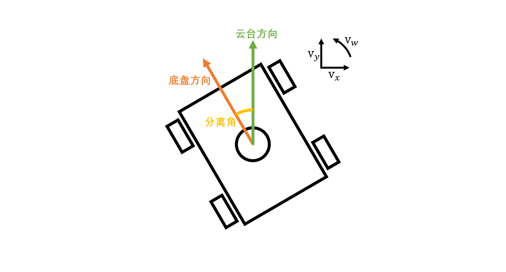

# 底盘模块

---

## 模块介绍

本模块用于控制一个**全向底盘**（目前仅实现麦轮底盘），如下图所示，本模块可以由用户指定底盘在云台坐标系下的移动速度vx、vy、vw，并指定云台和底盘间的分离角，以此计算电机转速并发送给电机模块



---

## 模块依赖项

### 模块依赖

- 服务类模块
	- 无
- 工具类模块
	- [斜坡函数模块](../../tools/slope/README.md)（必选）
	- [电机模块](../../tools/motor/README.md)（必选）

### 文件依赖

- 本模块文件
	- `chassis_mecanum.c`（必选）
- 底层库文件 
	- `cmsis_os.h`、`arm_math.h`（必选）

### 其他依赖

- 系统广播（可选）
	- `/system/stop`：在监听到该广播后会设置该模块下所有电机进入急停模式

---

## 准备工作

1. 根据电机电调通信类型配置相应外设，此处不详述操作细节
2. 由于此模块使用了`arm_math.h`来加速三角函数，因此需要添加DSP库，可以在CubeMX中进行添加
    - 打开Select Components
  
		
    - 选择DSP Library
  
		
    - 返回cubeMX,添加DSP Library

		

    - 将所有库拷贝到工程文件夹下

		
	
3. 打开Keil工程
    - 在全局宏定义处添加 `,ARM_MATH_CM4,__TARGET_FPU_VFP,__FPU_PRESENT=1U` ,以打开FPU
   
		
    - 修改Keil工程包含目录，删除原有的`arm_cortexM4l_math.lib`,添加\Drivers\CMSIS\Lib\ARM目录下`arm_cortexM4lf_math.lib`

		

---

## 模块配置项

1. 模块配置项
    
    | 配置名 | 数值类型 | 默认值 | 说明 |
    | :---: | :---: | :---: | :---: |
    | `task-interval` | `uint16_t` | 2 | 任务执行间隔 |
	| `name`          | `char*`    | `"chassis"` | 本服务的运行时名称 |
	| `info`          | `CF_DICT` | / | 底盘基础配置信息[>>>](#chassis2) |
	| `move`          | `CF_DICT` | / | 底盘移动配置信息[>>>](#chassis3) |
	| `motor-fl`      | `CF_DICT` | / | 左前电机配置信息[>>>](../../tools/motor/README.md/#模块配置项) |
	| `motor-fr`      | `CF_DICT` | / | 右前电机配置信息[>>>](../../tools/motor/README.md/#模块配置项) |
	| `motor-bl`      | `CF_DICT` | / | 左后电机配置信息[>>>](../../tools/motor/README.md/#模块配置项) |
	| `motor-br`      | `CF_DICT` | / | 右后电机配置信息[>>>](../../tools/motor/README.md/#模块配置项) |

2. <span id='chassis2'/>`info`配置项

    | 配置名 | 数值类型 | 默认值 | 说明 |
    | :---: | :---: | :---: | :---: |
    | `wheelbase`    | `float` | 0  | 底盘轴距 |
    | `wheeltrack`   | `float` | 0  | 底盘轮距 |
    | `wheel-radius` | `float` | 76 | 底盘轮半径 |
	| `offset-x`     | `float` | 0  | 底盘旋转中心x方向偏移 |
	| `offset-y`     | `float` | 0  | 底盘旋转中心y方向偏移 |

3. <span id='chassis3'/>`move`配置项

    | 配置名 | 数值类型 | 默认值 | 说明 |
    | :---: | :---: | :---: | :---: |
    | `max-vx` | `float` | 2000 | x方向最大速度(单位：mm/s) |
    | `max-vy` | `float` | 2000 | y方向最大速度(单位：mm/s) |
    | `max-vw` | `float` | 180  | 旋转最大角速度(单位：°/s) |
	| `x-acc`  | `float` | 1000 | x方向加速度(单位：mm/s²) |
	| `y-acc`  | `float` | 1000 | y方向加速度(单位：mm/s²) |

### 配置示例

```c
{"chassis", CF_DICT{
	//任务循环周期
	{"task-interval", IM_PTR(uint16_t, 2)},
	//底盘尺寸信息
	{"info", CF_DICT{
		{"wheelbase", IM_PTR(float, 100)},
		{"wheeltrack", IM_PTR(float, 100)},
		{"wheel-radius", IM_PTR(float, 76)},
		{"offset-x", IM_PTR(float, 0)},
		{"offset-y", IM_PTR(float, 0)},
		CF_DICT_END
	}},
	//底盘移动速度/加速度配置
	{"move", CF_DICT{
		{"max-vx", IM_PTR(float, 2000)},
		{"max-vy", IM_PTR(float, 2000)},
		{"max-vw", IM_PTR(float, 2)},
		{"x-acc", IM_PTR(float, 1000)},
		{"y-acc", IM_PTR(float, 1000)},
		CF_DICT_END
	}},
	//四个电机配置
	{"motor-fl", CF_DICT{
		{"type", "M3508"},
		{"id", IM_PTR(uint16_t, 1)},
		{"can-x", IM_PTR(uint8_t, 1)}
		{"speed-pid", CF_DICT{
			{"p", IM_PTR(float, 10)},
			{"i", IM_PTR(float, 1)},
			{"d", IM_PTR(float, 0)},
			{"max-i", IM_PTR(float, 10000)},
			{"max-out", IM_PTR(float, 20000)},
			CF_DICT_END
		}},
		CF_DICT_END
	}},
	{"motor-fr", CF_DICT{
		{"type", "M3508"},
		{"id", IM_PTR(uint16_t, 2)},
		{"can-x", IM_PTR(uint8_t, 1)},
		{"speed-pid", CF_DICT{
			{"p", IM_PTR(float, 10)},
			{"i", IM_PTR(float, 1)},
			{"d", IM_PTR(float, 0)},
			{"max-i", IM_PTR(float, 10000)},
			{"max-out", IM_PTR(float, 20000)},
			CF_DICT_END
		}},
		CF_DICT_END
	}},
	{"motor-bl", CF_DICT{
		{"type", "M3508"},
		{"id", IM_PTR(uint16_t, 3)},
		{"can-x", IM_PTR(uint8_t, 1)},
		{"speed-pid", CF_DICT{
			{"p", IM_PTR(float, 10)},
			{"i", IM_PTR(float, 1)},
			{"d", IM_PTR(float, 0)},
			{"max-i", IM_PTR(float, 10000)},
			{"max-out", IM_PTR(float, 20000)},
			CF_DICT_END
		}},
		CF_DICT_END
	}},
	{"motor-br", CF_DICT{
		{"type", "M3508"},
		{"id", IM_PTR(uint16_t, 4)},
		{"can-x", IM_PTR(uint8_t, 1)},
		{"speed-pid", CF_DICT{
			{"p", IM_PTR(float, 10)},
			{"i", IM_PTR(float, 1)},
			{"d", IM_PTR(float, 0)},
			{"max-i", IM_PTR(float, 10000)},
			{"max-out", IM_PTR(float, 20000)},
			CF_DICT_END
		}},
		CF_DICT_END
	}},
	CF_DICT_END
}},
```

---

## 软总线接口

> 注：下述广播和远程函数名称中`<chassis_name>`代表服务配置表中`name`配置项的值

### 广播接口

本模块暂无广播接口

### 远程函数接口
  
- **设置底盘移动速度**：`/<chassis_name>/speed`

	参数格式如下

	| 数据字段名 | 数据类型 | 是否为返回值 | 是否必须传输 | 说明 |
	| :---: | :---: | :---: | :---: | :---: |
	| `vx` | `float` | × | 可选 | 底盘在用户坐标系下x轴方向的速度(单位mm/s) |
	| `vy` | `float` | × | 可选 | 底盘在用户坐标系下y轴方向的速度(单位mm/s) |
	| `vw` | `float` | × | 可选 | 底盘旋转的角速度(单位°/s)  |

- **设置底盘移动加速度**：`/<chassis_name>/acc`

	参数格式如下

	| 数据字段名 | 数据类型 | 是否为返回值 | 是否必须传输 | 说明 |
	| :---: | :---: | :---: | :---: | :---: |
	| `ax` | `float` | × | 可选 | 底盘在用户坐标系下x轴方向的加速度(单位mm/s²) |
	| `ay` | `float` | × | 可选 | 底盘在用户坐标系下y轴方向的加速度(单位mm/s²) |

- **设置云台和底盘坐标系的分离角**：`/<chassis_name>/relative-angle`

	参数格式如下

	| 数据字段名 | 数据类型 | 是否为返回值 | 是否必须传输 | 说明 |
	| :---: | :---: | :---: | :---: | :---: |
	| `angle` | `float` | × | 必须 | 分离角(单位deg) |
