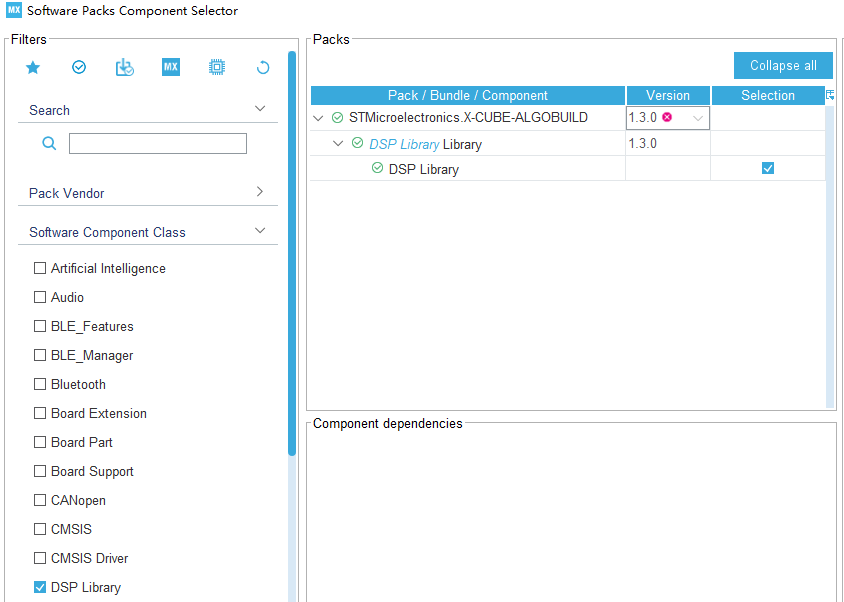

## 使用步骤

1. 打开CubeMX工程,添加DSP库
   - 打开Select Components
  
    
   - 选择DSP Library
  
	
   - 返回cubeMX,添加DSP Library

    
	
2. 打开Keil工程,在全局宏定义处添加 `,ARM_MATH_CM4,__TARGET_FPU_VFP,__FPU_PRESENT=1U` ,以打开FPU
   
   