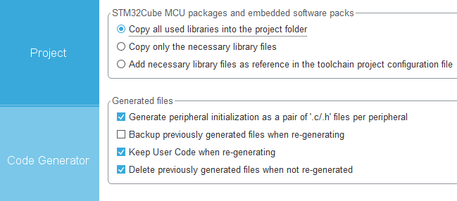
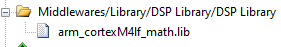

# 底盘模块

---

## 模块介绍

1. 这是整个代码库的底盘模块，根据用户设置的速度、加速度、和坐标系分离角计算出电机相应的转速目标值
2. 坐标系分离角：为用户坐标系和底盘坐标系之间的夹角。例如：当云台与底盘夹角45°时，此时如果按下前进按钮，应当以云台朝向方向前进而非底盘坐标系的y轴正方向，此时向底盘模块输入分离角，会解算出输入方向的速度映射到底盘坐标系下实际的速度
3. 由于此模块使用了`arm_math.h`来加速三角函数，因此需要[开启DSP库](#准备工作)。

## 模块依赖项

1. 文件依赖

    - 本项目文件
        - `softbus.c/h`、`config.c/h`、`slope.c/h`、`motor.c/h`(及其使用到的电机子类)
    - hal库文件 
        - `cmsis_os.h`、`arm_math.h`
2. 模块依赖

    - 系统广播
       - `/system/stop`：在监听到该广播后会设置该模块下所有电机进入急停模式

---

> 注：下面远程函数所写的数据类型为指针的项仅强调该项传递的应该是数组，实际传递的参数只需数组名即可，不需要传递数组名的地址。广播也是如此，所写的数据类型若为指针的仅强调该项传递的应该是数组，获取该项的值是仅需要强制类型转换成相应的指针即可，无需额外解引用

---

## 准备工作

1. 根据电机电调通信类型配置相应外设，此处不详述操作细节
2. 在CubeMX中添加DSP库
    - 打开Select Components
  
		
    - 选择DSP Library
  
		
    - 返回cubeMX,添加DSP Library

		

    - 将所有库拷贝到工程文件夹下

		
	
3. 打开Keil工程
    - 在全局宏定义处添加 `,ARM_MATH_CM4,__TARGET_FPU_VFP,__FPU_PRESENT=1U` ,以打开FPU
   
		
    - 修改Keil工程包含目录，删除原有的`arm_cortexM4l_math.lib`,添加\Drivers\CMSIS\Lib\ARM目录下`arm_cortexM4lf_math.lib`

		

## 模块配置项

1. 模块配置项
    
    | 配置名 | (数值类型)默认值 | 说明 |
    | :---: | :---: | :---: |
    | `task-interval` | (uint16_t)2                        | 任务执行间隔  |
	| `info`          | [>>](#chassis2)                   | 底盘基础配置信息  |
	| `move`          | [>>](#chassis3)                   | 底盘移动配置信息  |
	| `motor-fl`      | [>>](../../tools/motor/README.md) | 左前电机配置信息  |
	| `motor-fr`      | [>>](../../tools/motor/README.md) | 右前电机配置信息  |
	| `motor-bl`      | [>>](../../tools/motor/README.md) | 左后电机配置信息  |
	| `motor-br`      | [>>](../../tools/motor/README.md) | 右后电机配置信息  |

2. <span id='chassis2'>`info`配置项</span>

    | 配置名 | (数值类型)默认值 | 说明 |
    | :---: | :---: | :---: |
    | `wheelbase`    | (float)0 | 底盘轴距 |
    | `wheeltrack`   | (float)0    | 底盘轮距 |
    | `wheel-radius` | (float)76    | 底盘轮半径 |
	| `offset-x`     | (float)0    | 底盘旋转中心x方向偏移 |
	| `offset-y`     | (float)0    | 底盘旋转中心y方向偏移 |

3. <span id='chassis3'>`move`配置项</span>

    | 配置名 | (数值类型)默认值 | 说明 |
    | :---: | :---: | :---: |
    | `max-vx` | (float)2000 | x方向最大速度(单位：mm/s) |
    | `max-vy` | (float)2000 | y方向最大速度(单位：mm/s) |
    | `max-vw` | (float)180  | 旋转最大角速度(单位：°/s) |
	| `x-acc`  | (float)1000 | x方向加速度(单位：mm/s²) |
	| `y-acc`  | (float)1000 | y方向加速度(单位：mm/s²) |

#### 示例：

```c
{"chassis", CF_DICT{
	//任务循环周期
	{"task-interval", IM_PTR(uint16_t, 2)},
	//底盘尺寸信息
	{"info", CF_DICT{
		{"wheelbase", IM_PTR(float, 100)},
		{"wheeltrack", IM_PTR(float, 100)},
		{"wheel-radius", IM_PTR(float, 76)},
		{"offset-x", IM_PTR(float, 0)},
		{"offset-y", IM_PTR(float, 0)},
		CF_DICT_END
	}},
	//底盘移动速度/加速度配置
	{"move", CF_DICT{
		{"max-vx", IM_PTR(float, 2000)},
		{"max-vy", IM_PTR(float, 2000)},
		{"max-vw", IM_PTR(float, 2)},
		{"x-acc", IM_PTR(float, 1000)},
		{"y-acc", IM_PTR(float, 1000)},
		CF_DICT_END
	}},
	//四个电机配置
	{"motor-fl", CF_DICT{
		{"type", "M3508"},
		{"id", IM_PTR(uint16_t, 1)},
		{"can-x", IM_PTR(uint8_t, 1)}
		{"speed-pid", CF_DICT{
			{"p", IM_PTR(float, 10)},
			{"i", IM_PTR(float, 1)},
			{"d", IM_PTR(float, 0)},
			{"max-i", IM_PTR(float, 10000)},
			{"max-out", IM_PTR(float, 20000)},
			CF_DICT_END
		}},
		CF_DICT_END
	}},
	{"motor-fr", CF_DICT{
		{"type", "M3508"},
		{"id", IM_PTR(uint16_t, 2)},
		{"can-x", IM_PTR(uint8_t, 1)},
		{"speed-pid", CF_DICT{
			{"p", IM_PTR(float, 10)},
			{"i", IM_PTR(float, 1)},
			{"d", IM_PTR(float, 0)},
			{"max-i", IM_PTR(float, 10000)},
			{"max-out", IM_PTR(float, 20000)},
			CF_DICT_END
		}},
		CF_DICT_END
	}},
	{"motor-bl", CF_DICT{
		{"type", "M3508"},
		{"id", IM_PTR(uint16_t, 3)},
		{"can-x", IM_PTR(uint8_t, 1)},
		{"speed-pid", CF_DICT{
			{"p", IM_PTR(float, 10)},
			{"i", IM_PTR(float, 1)},
			{"d", IM_PTR(float, 0)},
			{"max-i", IM_PTR(float, 10000)},
			{"max-out", IM_PTR(float, 20000)},
			CF_DICT_END
		}},
		CF_DICT_END
	}},
	{"motor-br", CF_DICT{
		{"type", "M3508"},
		{"id", IM_PTR(uint16_t, 4)},
		{"can-x", IM_PTR(uint8_t, 1)},
		{"speed-pid", CF_DICT{
			{"p", IM_PTR(float, 10)},
			{"i", IM_PTR(float, 1)},
			{"d", IM_PTR(float, 0)},
			{"max-i", IM_PTR(float, 10000)},
			{"max-out", IM_PTR(float, 20000)},
			CF_DICT_END
		}},
		CF_DICT_END
	}},
	CF_DICT_END
}},
```

## 软总线接口

- 广播：无

- 远程函数
  
    1. `/<chassis_name>/speed`

        说明：设置底盘在用户坐标系下的速度，`<chassis_name>`为可以替换部分，例如：在配置文件中添加`{"chassis", "mecanum"},`就可以将默认的`/chassis/speed`，替换成`/mecanum/speed`

        传入参数数据：

        | 数据字段名 | 数据类型 | 是否为返回值 | 是否必须传输 | 说明 |
        | :---: | :---: | :---: | :---: | :---: |
        | `vx` | `float` | × | 可选 | 底盘在用户坐标系下x轴方向的速度(单位mm/s) |
        | `vy` | `float` | × | 可选 | 底盘在用户坐标系下y轴方向的速度(单位mm/s) |
        | `vw` | `float` | × | 可选 | 底盘旋转的角速度(单位°/s)  |
    
    2. `/<chassis_name>/acc`

        说明：设置底盘在用户坐标系下的加速度，`<chassis_name>`为可以替换部分，例如：在配置文件中添加`{"chassis", "mecanum"},`就可以将默认的`/chassis/acc`，替换成`/mecanum/acc`


        传入参数数据：

        | 数据字段名 | 数据类型 | 是否为返回值 | 是否必须传输 | 说明 |
        | :---: | :---: | :---: | :---: | :---: |
        | `ax` | `float` | × | 可选 | 底盘在用户坐标系下x轴方向的加速度(单位mm/s²) |
        | `ay` | `float` | × | 可选 | 底盘在用户坐标系下y轴方向的加速度(单位mm/s²) |
    
    3. `/<chassis_name>/relative-angle`

        说明：设置用户坐标系和底盘坐标系的分离角，`<chassis_name>`为可以替换部分，例如：在配置文件中添加`{"chassis", "mecanum"},`就可以将默认的`/chassis/relative-angle`，替换成`/mecanum/relative-angle`

        传入参数数据：

        | 数据字段名 | 数据类型 | 是否为返回值 | 是否必须传输 | 说明 |
        | :---: | :---: | :---: | :---: | :---: |
        | `angle` | `float` | × | 必须 | 底用户坐标系和底盘坐标系的分离角(单位°/s) |
