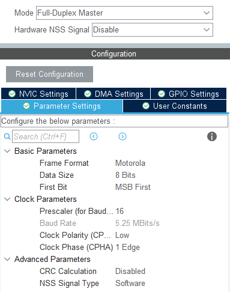

# INS模块

---

## 模块介绍

1. 这是整个代码库的惯导系统模块，根据imu的驱动获取imu的角速度和加速度，进而进行姿态解算出当前imu坐标系的姿态角同时广播出去
2. 目前bmi088配置未开放到`sys_conf.h`，如需要修改加速度计或陀螺仪量程等请到`bmi088_driver.c`中修改命令表的值，目前使用的是mahony算法作为姿态解算算法


## 模块依赖项

1. 文件依赖
    - 本项目文件
      	- `softbus.c/h`、`config.c/h`、`sys_conf.h`、`bmi088_driver.c/h`、`AHRS_MiddleWare.c/h`、`AHRS.lib/h`、`pid.c/h`、`filter.c/h`
    - 标准库文件
      	- `stdint.h`、`stdbool.h`、`stdlib.h`
    - hal库文件 
        - `cmsis_os.h`

---

> 注：下面远程函数所写的数据类型为指针的项仅强调该项传递的应该是数组，实际传递的参数只需数组名即可，不需要传递数组名的地址。广播也是如此，所写的数据类型若为指针的仅强调该项传递的应该是数组，获取该项的值是仅需要强制类型转换成相应的指针即可，无需额外解引用

---

## 准备工作

1. 在CubeMX中配置spi
  
   
	
## 模块配置项

1. 模块配置项
    
    | 配置名 | (数值类型)默认值 | 说明 |
    | :---: | :---: | :---: |
    | `task-interval`      | (uint16_t)2 | 任务执行间隔  |
	| `name`               | (char*)`"ins"` | 如果需要重命名模块则配置该项  |
	| `spi-x`              | (uint8_t)0  | imu外设所在spi |
	| `target-temperature` | (float)40   | imu目标温度  |
	| `tim-x`              | (uint8_t)10 | 温控pwm所在tim |
	| `channel-x`          | (uint8_t)1  | 温控pwm所在tim通道 |
	| `tmp-pid`            | [>>](../../tools/controller/README.md/#模块配置项) | 温控pid |

#### 示例：

```c
{"ins",CF_DICT{
	{"spi-x",IM_PTR(uint8_t,1)},
	{"tim-x",IM_PTR(uint8_t,10)},
	{"channel-x",IM_PTR(uint8_t,1)},
	{"tmp-pid", CF_DICT{
		{"p", IM_PTR(float, 0.15)},
		{"i", IM_PTR(float, 0.01)},
		{"d", IM_PTR(float, 0)},
		{"max-i", IM_PTR(float, 0.15)},
		{"max-out", IM_PTR(float, 1)},
		CF_DICT_END
	}},
	CF_DICT_END
}},
```

## 软总线接口

- 广播：

    - 快速方式：无
  
    - 普通方式
  
  	1. `/<ins_name>/euler-angle`

		说明：广播imu坐标系下3轴姿态角(单位：°)，`<ins_name>`为可以替换部分，例如：在配置文件中添加`{"name", "up-ins"},`就可以将默认的`/ins/euler-angle`，替换成`/up-ins/euler-angle`

        广播数据：

        | 数据字段名 | 数据类型 | 说明 |
        | :---: | :---: | :---: |
        | `yaw`   | `float` | imu坐标系的yaw旋转角度 |
		| `pitch` | `float` | imu坐标系的pitch旋转角度 |
		| `roll`  | `float` | imu坐标系的roll旋转角度 |

- 远程函数：无
  