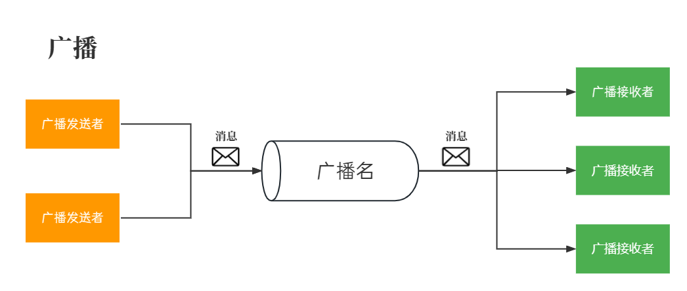
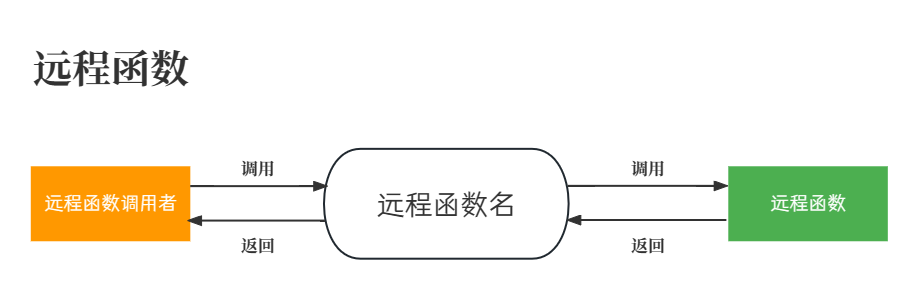

# 软总线

---

## 简介

本项目是一个数据交互模块，以实现多模块间解耦，模块之间可以通过广播模式或者远程函数模式进行数据交互

---

## 项目文件及依赖项

- 本项目文件
	- `softbus.c/h`
- 标准库文件
	- `stdint.h`、`string.h`、`stdlib.h`
- 其他项目文件
	- `vector.c/h`：[通用类型变长数组](../tools/universal_vector/README.md)

---

## **广播模式简介**

广播模式是一种多对多的数据传输的模式，提供了不同模块之间的数据传输通道

广播的发送者可以广播一系列消息，广播接收者可以订阅自己感兴趣的广播，以监听在该广播上所发布的所有消息



如上图所示，每个广播发送者/接收者就是一个模块，一个广播名就是一个字符串，每个广播名可以视作一个通信管道，发送者通过`"send"`操作向管道中写入数据，订阅该管道的接收者就可以收到数据

相较于传统方式中模块间直接调用对方的函数来传递数据，该模式使用字符串话题来标记所传输数据的意义，使得模块间不产生函数依赖和类型依赖，从而不产生文件依赖（无需相互引用对方的文件），以此实现模块间的松耦合

> 注：虽然广播模式支持多对多通信，但为降低模块间连接复杂度，建议尽可能只进行一对多通信，即同一广播名只由一个模块发出

## **远程函数模式简介**

远程函数模式是一种多对一数据传输模式，当一个模块将一个函数注册为远程函数后，即可被其他模块通过软总线进行调用

与广播模式相比，远程函数的主要意义在于可以向调用者返回数据，如下图所示：



需要注意的是，如果一个远程函数名下尝试注册多个回调函数，只有第一次注册的回调函数会被成功绑定，后续的注册操作会被忽略。

---

## 本模块概念阐述

- **软总线**：是对本模块作用的一种形象描述，系统中的所有模块通过本模块所提供的**广播**和**远程函数**功能进行数据传输，可以将本模块看做系统中的一根“总线”，各个模块挂接在总线上相互传输数据
- **数据帧**(Frame)：在总线上所传输的数据是以“数据帧”为单位的，发送广播或调用远程函数就是向软总线上发送一个数据帧
	- 数据帧是一个结构体，包含【数据】和【元素个数】两个信息
	- 数据帧分为两种，映射表数据帧和列表数据帧
		- **映射表数据帧**：数据帧中所传输的是一个映射表，可读性较好，但解析过程较慢
		- **列表数据帧**：数据帧中所传输的是一个列表，可读性较弱，但解析速度很快
- **映射表**(Map)：由若干个“键-值”对构成，每个键是一个字符串，值为任意类型。每个键在表中只会出现一次，唯一对应着一个值，通过键即可找到所对应的值
	- 在本模块中一个“键-值”对被称为一个字段(Item)，其中包含对应的【键(key)】和【值(value)】两个信息
	- 键有时也称作【字段名】
- **列表**(List)：由有序的若干个值构成，每个值有一个索引，从0开始编号，通过索引即可获取对应的值
- **快速句柄**(FastHandle)：在[广播的快速发布方式](#两种模式的发布方式和选用原则)中，需要提前由广播名字符串创建出快速句柄，后续发布时使用该句柄代替广播名字符串，其作用与广播名字符串一致
- **绑定数据**(bindData)：在订阅广播时，订阅者可以绑定一个自定义数据，在收到广播的同时也会收到该绑定数据
  > 例如：订阅者可以订阅一次"broadcast1"广播，此时绑定一个数据A，然后再次订阅"broadcast1"，并绑定一个数据B，那么当该广播发送时，该订阅者可以收到两次广播，分别附带有所绑定的A和B

---

## 发布方式及其选用原则

- **广播**
  - 普通方式
  	- 直接使用广播名字符串发布，使用方便，可读性较好
	- 必须使用映射表数据帧
	- 效率较低，适合发布频率较低的话题
  - 快速方式
	- 须提前创建好快速句柄，用句柄发布，可读性较弱，使用较繁琐
	- 必须使用列表数据帧
	- 效率较高，适合发布频率很高的话题

- **远程函数**
  - 普通方式
    - 使用远程函数名字符串调用远程函数
    - 必须使用映射表数据帧

**性能表现**：在168MHz主频的STM32F407中，本模块有以下性能表现
- 广播的普通发布方式在最简情况下最高能达到600kHz的调用频率，但随着注册的话题数和数据字段数量的增加，调用频率可能大幅下降至30kHz以下
- 广播的快速发布方式能达到2MHz调用频率，且不随话题数和数据帧长度发生变化
	> 注：1. 最简情况指仅在单个话题上注册单个空回调函数；2. 若回调内逻辑增加，广播的两种方式的发布频率都会明显下降

**选用原则**：基于可读性和效率的衡量，我们对两种模式及其发布方式的选用有以下建议
- **广播**
  - 当数据的传输形式为一对多时，使用**广播**模式
  - 当广播的平均发布频率**小于1kHz**时，使用**普通**发布方式，一般用于上层模块间数据传输
  - 当广播的平均发布频率**大于1kHz**时，使用**快速**发布方式，一般用于底层外设驱动模块
- **远程函数**
  - 当数据的传输形式为多对一或者请求的响应需要返回值时，使用**远程函数**模式 
---

## 接口使用示例

> 注：此处仅展示基础用法，若要获取更多说明请查看项目文件中代码注释

**发送广播**

```c
/* 普通发布方式 */
uint8_t value1 = 0x01; //要发布的第一个值
float value2 = 1.0f; //要发布的第二个值
Bus_BroadcastSend("topic1", {
	{"key1", &value1},
	{"key2", &value2}
}); //向总线广播一个映射表数据帧

/* 快速发布方式 */
//创建快速句柄(只在程序初始化时创建一次)
SoftBusReceiverHandle handle = Bus_CreateReceiverHandle("topic2"); 
//发布数据帧
uint16_t value = 0x201; //要发布的第一个值
uint8_t array[2] = {0x20, 0x01}; //要发布的第二个值
Bus_FastBroadcastSend(handle, {&value, array}); //向总线快速广播一个列表数据帧
```

**接收广播**

```c
//定义软总线回调函数，收到数据时会自动调用
void Callback(const char* name, SoftBusFrame* frame, void* bindData)
{
	if(strcmp(name, "topic1") == 0)
	{
		if(!Bus_CheckMapKeys(frame, {"key1", "key2"})) //确保数据帧中存在所需字段
			return;
		uint8_t value1 = *(uint8_t*)Bus_GetMapValue(frame, "key1"); //读取key1字段值
		float value2 = *(float*)Bus_GetMapValue(frame, "key2"); //读取key2字段值
		/* ...其他处理逻辑 */
	}
}

//为提高总线效率，一般使用单独回调函数订阅快速发布的话题
void FastCallback(const char* name, SoftBusFrame* frame, void* bindData)
{
	uint16_t value = *(uint16_t*)Bus_GetListValue(frame, 0); //获取第一个值
	uint8_t* array = (uint8_t*)Bus_GetListValue(frame, 1); //获取第二个值
	/* ...其他处理逻辑 */
}

//订阅话题
Bus_RegisterReceiver(NULL, Callback, "topic1");
Bus_RegisterReceiver(NULL, Fastcallback, "topic2");
```

**编写和注册远程函数**

```c
//定义远程函数回调函数，其他模块请求调用时会自动调用
//该远程函数接收四个参数，arg1:uint8_t, arg2:float, ret1:float, ret2:uint8_t
//前两个参数为输入参数，后两个为输出参数(返回值)
bool Callback(const char* name, SoftBusFrame* frame, void* bindData)
{

	if(!Bus_CheckMapKeys(frame, {"arg1", "arg2"，"ret1", "ret2"})) //确保数据帧中存在所需所有参数
		return false;
	uint8_t value1 = *(uint8_t*)Bus_GetMapValue(frame, "arg1"); //读取arg1参数值
	float value2 = *(float*)Bus_GetMapValue(frame, "arg2"); //读取arg2参数值
	float* result1 = (float*)Bus_GetMapValue(frame, "ret1"); //读取ret1参数值
	uint8_t* result2 = (uint8_t*)Bus_GetMapValue(frame, "ret2"); //读取ret2参数值
	
	//...其他处理逻辑

	//返回数据
	*result1 = /* ... */;
	*result2 = /* ... */;
	return true;
}

//向软总线注册该回调函数
Bus_RegisterRemoteFunc(NULL, Callback, "fun1")

```

**调用远程函数**

```c
uint8_t value1 = 0x01; //要传入的第一个参数
float value2 = 1.0f; //要传入的第二个参数
float result1; //用于接收远程函数第一个返回值
uint8_t result2;  //用于接收远程函数第二个返回值
Bus_RemoteCall("fun1", {
	{"arg1", &value1},
	{"arg2", &value2},
	{"ret1", &result1},
	{"ret2", &result2}
}); //调用远程函数fun1

```

---

## 注意事项

1. 回调函数是在广播发送者或者远程函数调用者所在线程中执行的，因此**回调函数的执行速度应尽可能快**，切不可发生阻塞
	> 注：用`Bus_BroadcastSend`或`Bus_FastBroadcastSend`函数发布时，只有当订阅了该name的所有回调函数执行结束后，该发布函数才会退出
2. **收到广播数据帧时，不得修改数据帧内容**，否则会导致后续回调函数收到的数据异常
3. 软总线仅会传输数据的地址(data指针)，且**数据指针仅保证在回调函数范围内有效**，若需在回调函数外使用这些数据，请在回调中拷贝整个数据，而不只是保存数据指针
4. 软总线底层通过hash表进行字符串的匹配，可以通过修改`SoftBus_Str2Hash`这个宏来更换hash函数，经测试在字符串长度小于20个字节时，`SoftBus_Str2Hash_8`函数效率较高，而在字符串长度大于20个字节时，`SoftBus_Str2Hash_32`函数效率较高
