# 电机类

---

## 模块简介

本模块基于面向对象的继承和多态思想实现了对多种电机的描述，包括CAN电机、舵机、L298N时序直流电机等

### 封装方式介绍

本模块使用C语言的结构体模拟**类**，用结构体嵌套模拟**继承**关系（父类结构体位于子类结构体的第一个成员），用函数指针实现虚函数表以实现运行时**多态**，下图以M3508类为例展示一个电机的初始化流程



如上图所示，在上层服务模块使用如下语句创建一个电机时
```c
Motor* motor = Motor_Init(dict);
```
本模块会进行如下操作：
1. 根据配置表中的`type`属性判定使用哪个子类，调用该子类的构造函数
2. 创建该子类的对象（即结构体变量），该对象头部包含父类对象（即虚函数表）
3. 设置该对象的各个属性，包括虚函数表和其他子类属性
4. 返回父类类型的指针`Motor*`给上层模块

此时就完成了一个电机对象的创建，上层服务所获取到的指针`Motor* motor`指向的并不只是一个`Motor`类型的结构体，而是一个完整的子类对象

当需要对电机进行操作时，通过返回的虚函数表即可直接调用子类函数，例如调用
```c
motor->setTarget(motor, 100);
```
时，实际调用的是子类函数，如`M3508_SetTarget(motor, 100)`

### 目前支持的电机

- 大疆M3508电机
- 大疆M2006电机
- 大疆M6020电机
- L298N时序的直流电机
- 舵机

---

## 模块依赖项

### 文件依赖

- 本模块文件
	- `motor.c/h`（必选）、子类文件（可选）
- 底层库文件 
	- `cmsis_os.h`（必选）

---

## 准备工作

1. 将`motor.c/h`及其需要的子类文件添加至项目

## 模块配置项

```c
{"motor", CF_DICT{
	{"type", "M3508"}, //输入子类类型
	...                //根据子类需要的配置信息填入
	CF_DICT_END
}},
```
- 具体的子类配置信息，详见子类说明
	- [大疆电机配置项](motor_can/README.md/#模块配置项)
	- [PWM电机配置表](motor_pwm/README.md/#模块配置项)

---

## 接口说明

1. `Motor* Motor_Init(ConfItem* dict)`
   
   会根据传入的配置中的类型自动调用对应的子类构造函数，并返回父类指针。使用示例：

	```c
	Motor* motor = NULL;
	motor = Motor_Init(dict);
	```

2. 电机类中的`changeMode`接口

	通过此函数可以更改电机的控制模式，可选择力矩模式、速度模式或角度模式。使用示例：

	```c
	Motor* motor = NULL;
	motor = Motor_Init(dict);
	motor->changeMode(motor, MOTOR_TORQUE_MODE);//力矩模式
	motor->changeMode(motor, MOTOR_SPEED_MODE);//速度模式
	motor->changeMode(motor, MOTOR_ANGLE_MODE);//角度模式
	```

	> 注意：有些类型的电机并不支持所有模式，请以子类说明文档为准

3. 电机类中的`setTarget`接口

	通过此函数可以更改电机的目标值。不同控制模式下数值的意义不同：

	- 角度控制模式：输出轴的目标角度，单位deg
	- 速度控制模式：输出轴的目标速度，单位rpm
	- 扭矩控制模式：电机的扭矩输出量，具体取值范围需参考子类说明文档
	
	使用示例：

	```c
	Motor* motor = NULL;
	motor = Motor_Init(dict);
	motor->changeMode(motor, MOTOR_ANGLE_MODE);//设置为角度模式
	motor->setTarget(motor, 60);//设置输出轴角度60°
	```

4. 电机类中的`setStartAngle`接口

	通过此函数可以直接设置电机输出轴(不是转子)的当前累计角度，此后的旋转角会在此基础上进行累加：

	```c
	Motor* motor = NULL;
	motor = Motor_Init(dict);
	motor->setStartAngle(motor, -60);//设置当前的累计角度为-60°
	```

5. 电机类中的`getData`接口

	通过此函数可以获取电机的部分数据。目前可用的数据有：
	
	- 转子距离编码器零点的角度`"angle"`
	- 输出轴累计转角`"totalAngle"`
  	
	使用示例：

	```c
	Motor* motor = NULL;
	motor = Motor_Init(dict);
	motor->getData(motor, "angle");//获取转子角度，单位：°
	motor->getData(motor, "totalAngle");//获取输出轴总角度，单位：°
	```

6. 电机类中的`stop`接口

	通过此函数可以使电机进入急停模式，该模式无法退出，仅可以通过复位单片机恢复。使用示例：

	```c
	Motor* motor = NULL;
	motor = Motor_Init(dict);
	motor->stop(motor);
	```

---

## 注意事项

- 在调试过程中若需要查看子类属性，需要在调试变量窗口对父类变量进行类型转换。如：

	
