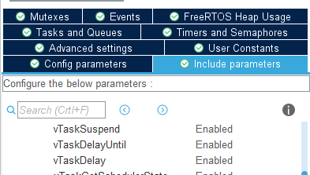
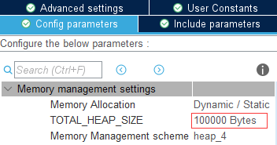

# UIML 开发指南

---

## UIML 使用步骤

**本节讲述初次上手时如何进行UIML项目的创建和配置**

1. 创建工程并移植FreeRTOS系统。推荐使用STM32CubeMX进行代码工程的生成和FreeRTOS的配置 [>>>](#使用CubeMX创建工程并配置FreeRTOS)
2. 将所有所需的文件添加至工程中 [>>>](#添加项目文件)
3. 根据各模块的说明文档，使用指定的格式编写系统配置文件 [>>>](#编写系统配置文件)
4. 根据功能需求编写用户逻辑

### 使用CubeMX创建工程并配置FreeRTOS

1. **创建新工程**，选择所需芯片，配置时钟树，此处不详述操作细节
   > 注：请勾选将外设驱动代码生成到独立的.c/h文件中
2. 根据UIML的外设周边模块说明文档**进行外设配置**，此处不详述操作细节
3. **配置FreeRTOS**，以下简要介绍操作过程
	- 使能FreeRTOS，选择为`CMSIS_V1`版本
		
		

	- 将初始任务的`Code Generation Option`设置为`As weak`，不需要额外添加任何其他任务
		
		

	- 打开软件定时器，并将其优先级设置为6，定时器队列大小设置为20
		
		

	- 开启`vTaskDelayUntil`
		
		

	- 修改堆栈大小，建议的系统堆栈和RTOS堆大小为如下图所示
		
		
		

### 添加项目文件

1. 添加核心模块文件
	- `/softbus`目录下的所有.c/h文件（软总线模块）
	- `/conf`目录下的所有.c/h文件（系统配置模块）
2. 按需添加周边模块文件，请参考所需模块说明文档中的`依赖项`部分
	> 注：添加模块时，也要添加其所依赖的其他模块

### 编写系统配置文件

系统配置文件位于`/conf/sys_conf.h`，是整个UIML库的配置文件，用户需要在其中：

1. 配置所开启的硬件外设
2. 指定需要开启的服务类任务列表
3. 参考所需服务类任务的说明文档，编写每个服务类任务的配置表

具体配置语法需参考 [配置模块说明](conf/README.md)

---

## UIML 开发说明

**本节讲述如何自行创建模块并添加到框架中**

### 添加工具类模块

- 工具类模块不与RTOS任务相关，也无需接收用户的系统配置，因此创建普通工具类模块**没有特殊要求**，只需建立对应的.c/h文件后编写相关接口函数即可

- 对于一些集合多种相似子模块于一体的特殊模块，可以使用**继承和多态**的思想，编写父类模块和子类模块并用结构体创建继承关系，并用函数指针实现函数虚表以实现运行时多态，可以参考典型案例 [电机模块](tools/motor)

### 添加服务类模块

1. **创建一个.c文件**（可以不用.h）
2. 在其中**添加一个FreeRTOS任务函数**，其中应该使用`while(1)`形成死循环，或在结束时使用`vTaskDelete`销毁自身
3. 在进入任务函数后，可使用系统配置模块中提供的接口从参数中**读取配置表**，然后编写其他任务逻辑
4. **修改系统配置文件**，将该服务加入列表，然后编写服务的配置表

---

## UIML 开发规范

为尽可能增强项目的可读性和可维护性，本项目指定了下述各项开发规范

### 格式规范

代码格式方面，在本队[电控组编码规范](TARS_Go电控组编码规范.md)的基础上，添加了下述规则

- 变量名规定使用**小写开头的驼峰命名法**
- 函数名规定使用**模块名+下划线+大写开头驼峰命名法**
- 代码文件名使用**小写字母+下划线命名法**
- 各模块配置项、软总线中的广播名、远程函数名、软总线映射表数据帧的键均使用**小写字母+减号分隔**

### 逻辑规范

为减小模块间的耦合度，降低程序逻辑错误概率，添加了下述针对代码逻辑的规范

- 需要一对多通信时，应使用软总线广播，尽量避免多个模块发送相同广播
- 需要多对一通信时，应使用软总线远程函数
- 必须进行多对多通信时，应考虑是否将该事件升级为系统事件，以`/system`作为广播名开头
- 软总线广播中不应修改传入的数据帧，而远程函数中可以修改，同时必须要在说明文档中标注

### 说明文档规范

每个模块都必须配有MarkDown编写的说明文档`README.md`，放在该模块最上层文件夹下，且可以包含下述章节：

- `模块介绍`：对该模块的介绍，如所描述的对象、使用的算法、代码结构等
- `模块依赖项`：该模块所依赖的文件或其他模块
	- `文件依赖`：要添加该模块需要添加的文件，包含本模块文件、框架文件或库文件等
	- `模块依赖`：添加该模块前需要添加的其他模块，以及使用了这些模块的什么软总线接口
- `准备工作`：添加该模块前的准备工作，如进行CubeMX配置等
- `模块配置项`：使用表格展示本模块允许的系统配置项及其格式和含义，可给出配置表示例
- `软总线接口`：使用表格展示本模块发送的广播数据帧格式和注册的远程函数参数格式
- `注意事项`：使用该模块时的注意事项

---

## UIML 开发注意事项

- 部分模块依赖其他模块的数据，需要等待依赖项稳定后才可以运行，目前可以通过手动添加delay进行等待，后续可能开发自动延迟触发功能。
	> 例如：CAN电机计算初始角度需要先接收到电机反馈信号后才可以运行；云台需要惯导数据才能完成初始化，而惯导又需要开启SPI后获取到IMU数据才能解算。
